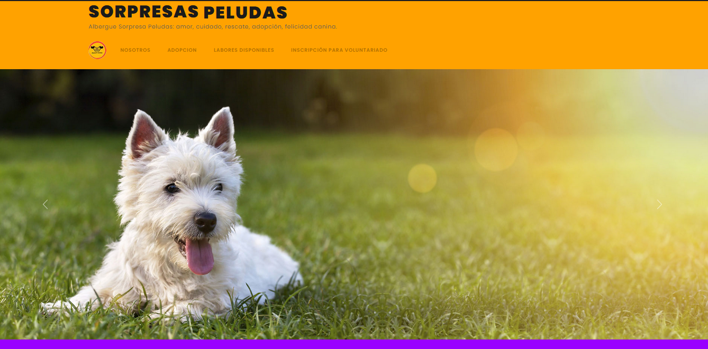
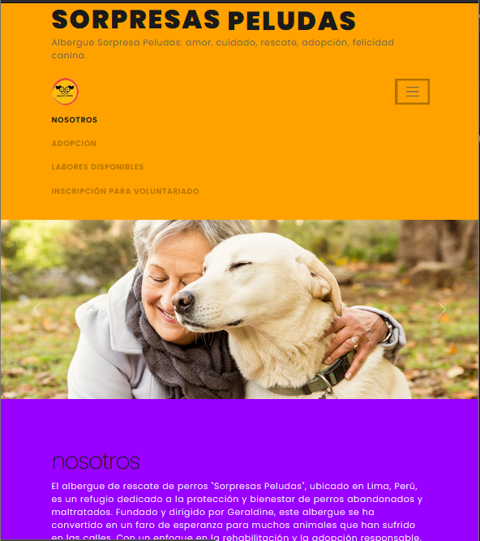

# Tarea

## Sorpresas Peludas - Albergue Canino

## Descripción del Proyecto

"Sorpresas Peludas" es un sitio web dedicado a un albergue de rescate de perros. El objetivo del sitio es proporcionar información sobre el albergue, los perros en adopción y permitir que los voluntarios se inscriban para ayudar en diversas labores.

## Herramientas Utilizadas

- **HTML**: Se utilizó HTML para estructurar el contenido del sitio web.
- **CSS**: Se aplicaron estilos personalizados para mejorar la apariencia del sitio.
- **Bootstrap**: Se utilizó Bootstrap, un framework CSS, para facilitar el diseño responsivo y la creación de componentes como formularios, botones y tarjetas.
- **JavaScript**: Se incluyó Bootstrap JS para habilitar interactividad, como el carrusel de imágenes.

## Estructura del Proyecto

El proyecto está organizado de la siguiente manera:

- **index.html**: Es la página principal del sitio web.

- **styles.css**: Contiene los estilos CSS personalizados.

- **bootstrap.min.css**: Es el archivo CSS de Bootstrap.

- **bootstrap.min.js**: Es el archivo JavaScript de Bootstrap.

## Proceso de Desarrollo

1. **Planificación**: Se definieron los objetivos del sitio web y se esbozaron las secciones necesarias, como "Nosotros", "En Adopción" y "Inscripción para Voluntariado".

2. **Configuración del Entorno**: Se creó la estructura de carpetas y se incluyeron los archivos necesarios, como HTML, CSS y las imágenes.

3. **Diseño de la Interfaz**:
   - Se utilizó Bootstrap para crear un diseño responsivo y atractivo.
   - Se implementó un carrusel de imágenes en la parte superior de la página para mostrar a los perros en adopción.
   - Se crearon secciones informativas sobre el albergue y las labores disponibles.

4. **Formulario de Inscripción**:
   - Se diseñó un formulario utilizando el sistema de grid de Bootstrap para permitir que los voluntarios se inscriban en las labores.
   - Se incluyó un campo de selección múltiple para que los usuarios elijan en qué labores desean participar.

5. **Pruebas**: Se realizaron pruebas en diferentes dispositivos y navegadores para asegurar que el sitio se vea y funcione correctamente.

## Captura de Pantalla

## Diseño para Pantallas de Computadora



### Diseño para Pantallas de Moviles



## Cómo Ejecutar el Proyecto

1. **Clonar el Repositorio**:

   ```bash
   git clone https://github.com/tu_usuario/sorpresas-peludas.git
